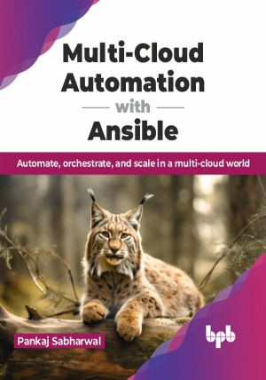

# Multi-Cloud Automation with Ansible

One tool, endless possibilities: Multi-cloud mastery with Ansible

This is the repository for [Multi-Cloud Automation with Ansible
](https://bpbonline.com/products/multi-cloud-automation-with-ansible?variant=43080295383240),published by BPB Publications.

## About the Book
Across the modern IT landscape, managing infrastructure across diverse cloud platforms has become a formidable task. Ansible, a robust open-source automation tool, emerges as the ultimate weapon in your arsenal, unlocking efficiency and control over your multi-cloud environment, such as IBM, AWS, GCP, and Azure. 

Indulge in an in-depth venture through Ansible's fundamentals, architecture, and applications in multi-cloud environments with use cases. Gain a deep understanding of core concepts, such as playbooks, tasks, and roles, and learn to set up Ansible seamlessly across diverse operating systems and cloud providers. Master the creation of efficient playbooks to automate infrastructure provisioning, application deployment, and configuration management in multi-cloud scenarios. Dig into advanced areas like network automation, security automation, and edge computing, acquiring the skills to automate intricate tasks effortlessly.

By the end of this book, you will emerge as a confident Ansible expert, capable of automating your multi-cloud operations with precision and efficiency. You will gain the skills to reduce manual effort, minimize errors, and achieve unprecedented agility in your cloud deployments.

## What You Will Learn
• Write efficient Ansible Playbooks for automated system configurations.

• Deploy and manage cloud infrastructure across major providers seamlessly.

• Integrate Ansible with Kubernetes for container orchestration automation.

• Implement Ansible Automation Platform and Tower for enterprise scaling.

• Apply Ansible techniques to automate AI and deep learning pipelines.
